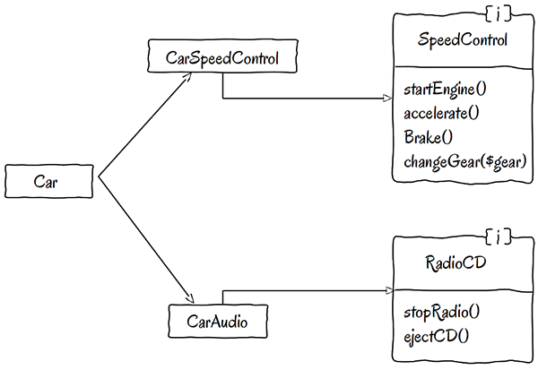

# Interface Segregation Principle - принцип разделения интерфейсов

## Основной принцип
*Зависимости, несущие лишний груз ненужных и неиспользуемых особенностей, могут стать причинной неожиданных проблем.*
