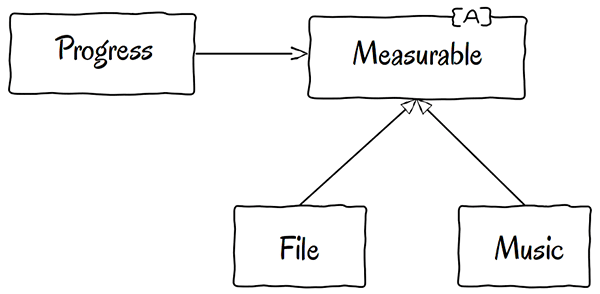

# Liskov Substitution Principle - принцип подстановки Барбары Лисков
*Здесь требуется что-то вроде следующего свойства подстановки: если для каждого объекта o1 типа S существует такой объект o2 типа T, что для всех программ P, определенных в терминах T, поведение P не изменяется при подстановке o1 вместе o2, то S является подтипом T.*

## Правило использование
*Принцип подстановки Барбары Лисков может и должен распространяться до уровня архитектуры. Простое нарушение совместимости может вызывать загрязнение архитектуры системы значительным количеством дополнительных механизмов.*

