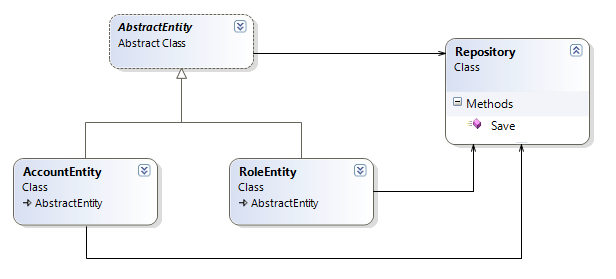
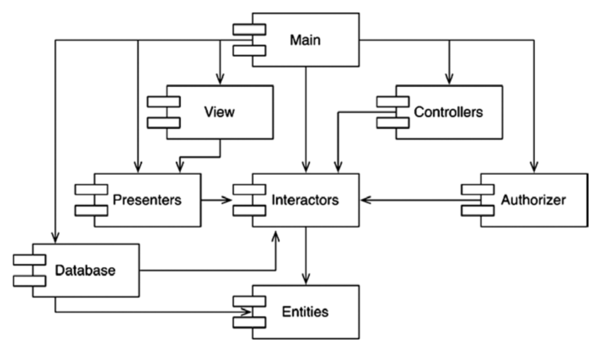

# Open-Closed Principle - принцип открытости/закрытости
*Программные сущности должны быть открыты для расширения и закрыты для изменения*

## Мысленный эксперимент
_Например: есть некая финансовая сводка. Содержимое страницы прокручивается, и отрицательные значения выводятся крысным цветом._

    Новая задача: нужно перенести данный отчет на черном белую бумагу, но также с той же разметкой. Отрицательные значения закрашенные красным цветом изменить на просто закрытая скобками.

В ПО с хорошо проработанной архитектурой таких изменений должно быть очень немного. В идеале их недолжно быть.
_Важно разделить отдельные ответственности: вычесление данных для отчета и способ представления этих данных._

## Условия
*Сделав разделение, важно сохранить независимость в исходном коде, чтобы изменения в одной ответственности не вызывали необходимости изменений в другой. Кроме того, новая организация должна гарантировать возможность расширения поведения без отмены изменений.*

## Решение
*Нужно выделить процессы в классы, а классы в компоненты.*

