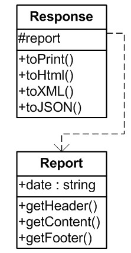

# Single Responsibility Principle - принцип единственной ответственности
*Функция должна выполнять что-то одно и только одно*

## Объяснение
_В файле srp существует 3 основные функции:_
    - сalculatePay - определяемая бухгалтерией.
    - reportHours - определяемая HR.
    - regularHours - функция используемая 1 и 2 ф-ей, для уменьшения кода.
    - save - определяемая администраторами БД.

## Проблема
*Например: одному разработчику дано было поручение внести изменения, он заметил, что calculatePay вызывает regularHours, но незаметил, что также reportHours вызывает данную фунцию и внёс свои изменения. Разумеется, сотрутники по работе с персоналом не знали об этом. В итоге на протяжение месяца HR получали не правильные показатели по ЗП*

